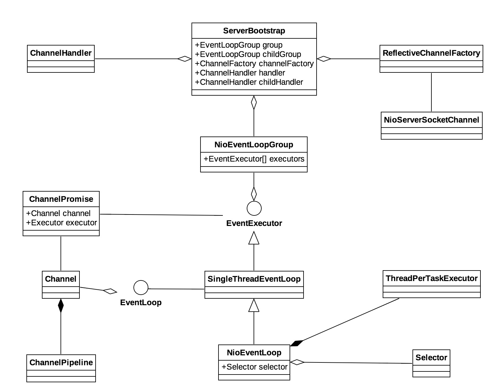

Netty是由JBOSS提供的一个java开源框架。Netty提供异步的、事件驱动的网络应用程序框架和工具，用以快速开发高性能、高可靠性的网络服务器和客户端程序。本文讲会对Netty服务启动的过程进行分析，主要关注启动的调用过程，从这里面进一步理解Netty的线程模型，以及Reactor模式。



这是我画的一个Netty启动过程中使用到的主要的类的概要类图，当然是用到的类比这个多得多，而且我也忽略了各个类的继承关系，关于各个类的细节，可能以后会写单独的博客进行分析。在这里主要注意那么几个地方：

	1. ChannelPromise关联了Channel和Executor，当然channel中也会有EventLoop的实例。
	2. 每个channel有自己的pipeline实例。
	3. 每个NioEventLoop中有自己的Executor实例和Selector实例。 

网络请求在NioEventLoop中进行处理，当然accept事件也是如此，它会把接收到的channel注册到一个EventLoop的selector中，以后这个channel的所有请求都由所注册的EventLoop进行处理，这也是Netty用来处理竞态关系的机制，即一个channel的所有请求都在一个线程中进行处理，也就不会存在跨线程的冲突，因为这些调用都线程隔离了。

下面我们先看一段Netty源码里面带的example代码，直观感受一下Netty的使用：

```java
        // Configure the server.
        EventLoopGroup bossGroup = new NioEventLoopGroup(1);
        EventLoopGroup workerGroup = new NioEventLoopGroup();
        try {
            ServerBootstrap b = new ServerBootstrap();
            b.group(bossGroup, workerGroup)
             .channel(NioServerSocketChannel.class)
             .option(ChannelOption.SO_BACKLOG, 100) // 设置tcp协议的请求等待队列
             .handler(new LoggingHandler(LogLevel.INFO))
             .childHandler(new ChannelInitializer<SocketChannel>() {
                 @Override
                 public void initChannel(SocketChannel ch) throws Exception {
                     ChannelPipeline p = ch.pipeline();
                     if (sslCtx != null) {
                         p.addLast(sslCtx.newHandler(ch.alloc()));
                     }
                     p.addLast(new EchoServerHandler());
                 }
             });

            // Start the server.
            ChannelFuture f = b.bind(PORT).sync();

            // Wait until the server socket is closed.
            f.channel().closeFuture().sync();
        } finally {
            // Shut down all event loops to terminate all threads.
            bossGroup.shutdownGracefully();
            workerGroup.shutdownGracefully();
        }
```

首先我们先来了解Netty的主要类：

**EventLoop** 这个相当于一个处理线程，是Netty接收请求和处理IO请求的线程。

**EventLoopGroup** 可以理解为将多个EventLoop进行分组管理的一个类，是EventLoop的一个组。

**ServerBootstrap** 从命名上看就可以知道，这是一个对服务端做配置和启动的类。

**ChannelPipeline** 这是Netty处理请求的责任链，这是一个ChannelHandler的链表，而ChannelHandler就是用来处理网络请求的内容的。

**ChannelHandler** 用来处理网络请求内容，有ChannelInboundHandler和ChannelOutboundHandler两种，ChannlPipeline会从头到尾顺序调用ChannelInboundHandler处理网络请求内容，从尾到头调用ChannelOutboundHandler处理网络请求内容。这也是Netty用来灵活处理网络请求的机制之一，因为使用的时候可以用多个decoder和encoder进行组合，从而适应不同的网络协议。而且这种类似分层的方式可以让每一个Handler专注于处理自己的任务而不用管上下游，这也是pipeline机制的特点。这跟TCP/IP协议中的五层和七层的分层机制有异曲同工之妙。

现在看上面的代码，首先创建了两个EventLoopGroup对象，作为group设置到ServerBootstrap中，然后设置Handler和ChildHandler，最后调用bind()方法启动服务。下面按照Bootstrap启动顺序来看代码。

```java
    public ServerBootstrap group(EventLoopGroup parentGroup, EventLoopGroup childGroup) {
        super.group(parentGroup);
        if (childGroup == null) {
            throw new NullPointerException("childGroup");
        }
        if (this.childGroup != null) {
            throw new IllegalStateException("childGroup set already");
        }
        this.childGroup = childGroup;
        return this;
    }
```

首先是设置EverLoopGroup，parentGroup一般用来接收accpt请求，childGroup用来处理各个连接的请求。不过根据开发的不同需求也可以用同一个group同时作为parentGroup和childGroup同时处理accpt请求和其他io请求。

```java
    public B channel(Class<? extends C> channelClass) {
        if (channelClass == null) {
            throw new NullPointerException("channelClass");
        }
        return channelFactory(new ReflectiveChannelFactory<C>(channelClass));
    }
```

接下来的channel()方法设置了ServerBootstrap的ChannelFactory，这里传入的参数是NioServerSocketChannel.class，也就是说这个ReflectiveChannelFactory创建的就是NioServerSocketChannel的实例。

后面的option()，handler()和childHandler()分别是设置Socket连接的参数，设置parentGroup的Handler，设置childGroup的Handler。childHandler()传入的ChannelInitializer实现了一个initChannel方法，用于初始化Channel的pipeline，以处理请求内容。

之前都是在对ServerBootstrap做设置，接下来的ServerBootstrap.bind()才是启动的重头戏。我们继续按照调用顺序往下看。

```java
    public ChannelFuture bind(int inetPort) {
        return bind(new InetSocketAddress(inetPort));
    }

	  /**
     * Create a new {@link Channel} and bind it.
     */
    public ChannelFuture bind(SocketAddress localAddress) {
        validate();
        if (localAddress == null) {
            throw new NullPointerException("localAddress");
        }
        return doBind(localAddress);
    }

    // AbstractBootstrap
	  private ChannelFuture doBind(final SocketAddress localAddress) {
        final ChannelFuture regFuture = initAndRegister();
        final Channel channel = regFuture.channel();
        if (regFuture.cause() != null) {
            return regFuture;
        }

        if (regFuture.isDone()) {
            // At this point we know that the registration was complete and successful.
            ChannelPromise promise = channel.newPromise();
            doBind0(regFuture, channel, localAddress, promise);
            return promise;
        } else {
            // Registration future is almost always fulfilled already, but just in case it's not.
            final PendingRegistrationPromise promise = new PendingRegistrationPromise(channel);
            regFuture.addListener(new ChannelFutureListener() {
                @Override
                public void operationComplete(ChannelFuture future) throws Exception {
                    Throwable cause = future.cause();
                    if (cause != null) {
                        // Registration on the EventLoop failed so fail the ChannelPromise directly to not cause an
                        // IllegalStateException once we try to access the EventLoop of the Channel.
                        promise.setFailure(cause);
                    } else {
                        // Registration was successful, so set the correct executor to use.
                        // See https://github.com/netty/netty/issues/2586
                        promise.registered();

                        doBind0(regFuture, channel, localAddress, promise);
                    }
                }
            });
            return promise;
        }
    }
```

我们可以看到bind()的调用最终调用到了doBind(final SocketAddress)，在这里我们看到先调用了initAndRegister()方法进行初始化和register操作。了解JavaNIO框架的同学应该能看出来是在这个方法中将channel注册到selector中的。最后程序再调用了doBind0()方法进行绑定，先按照顺序看initAndRegister方法做了什么操作。

```java
    // AbstractBootstrap
    final ChannelFuture initAndRegister() {
        Channel channel = null;
        try {
            channel = channelFactory.newChannel();
            init(channel);
        } catch (Throwable t) {
          // ...
        }

        ChannelFuture regFuture = config().group().register(channel);
        // ...
        return regFuture;
    }

```

为了简单其间，我忽略了处理异常分支的代码，同学们有兴趣可以自行下载Netty源码对照。在这里终于看到channel的创建了，调用的是ServerBootstrap的channelFactory，之前的代码我们也看到了这里的工厂是一个ReflectChannelFactory，在构造函数中传入的是NioServerSocketChannel.class，所以这里创建的是一个NioServerSocketChannel的对象。接下来init(channel)对channel进行初始化。

```java
    // ServerBootstrap
    void init(Channel channel) throws Exception {
        final Map<ChannelOption<?>, Object> options = options0();
        synchronized (options) {
            channel.config().setOptions(options);
        }
        
        // 设置channel.attr
        final Map<AttributeKey<?>, Object> attrs = attrs0();
        synchronized (attrs) {
            for (Entry<AttributeKey<?>, Object> e: attrs.entrySet()) {
                @SuppressWarnings("unchecked")
                AttributeKey<Object> key = (AttributeKey<Object>) e.getKey();
                channel.attr(key).set(e.getValue());
            }
        }

        ChannelPipeline p = channel.pipeline();

        final EventLoopGroup currentChildGroup = childGroup;
        // childGroup的handler
        final ChannelHandler currentChildHandler = childHandler;
        final Entry<ChannelOption<?>, Object>[] currentChildOptions;
        final Entry<AttributeKey<?>, Object>[] currentChildAttrs;
        synchronized (childOptions) {
            currentChildOptions = childOptions.entrySet().toArray(newOptionArray(childOptions.size()));
        }
        synchronized (childAttrs) {
            currentChildAttrs = childAttrs.entrySet().toArray(newAttrArray(childAttrs.size()));
        }
        // 给channelpipeline添加handler
        p.addLast(new ChannelInitializer<Channel>() {
            @Override
            public void initChannel(Channel ch) throws Exception {
                final ChannelPipeline pipeline = ch.pipeline();
                // group的handler
                ChannelHandler handler = config.handler();
                if (handler != null) {
                    pipeline.addLast(handler);
                }

                // We add this handler via the EventLoop as the user may have used a ChannelInitializer as handler.
                // In this case the initChannel(...) method will only be called after this method returns. Because
                // of this we need to ensure we add our handler in a delayed fashion so all the users handler are
                // placed in front of the ServerBootstrapAcceptor.
                ch.eventLoop().execute(new Runnable() {
                    @Override
                    public void run() {
                        pipeline.addLast(new ServerBootstrapAcceptor(
                                currentChildGroup, currentChildHandler, currentChildOptions, currentChildAttrs));
                    }
                });
            }
        });
    }
```

先是设置了channel的option和attr，然后将handler加入到channelpipleline的handler链中，这里大家请特别注意**ServerBootstrapAcceptor**这个Handler，因为接下来对于客户端请求的处理以及工作channl的注册可全是这个Handler处理的。不过由于现在channel还没有注册，所以还不会调用initChannel()方法，而是将这个handler对应的context加入到一个任务队列中，等到channel注册成功了再执行。关于ChannelPipeline的内容我们以后再说。然后在initAndRegister()方法中调用config().group().register(channel)对channel进行注册。config().group()获取到的其实就是bossGroup，在这个例子中就是一个NioEventLoopGroup，由于它继承了MultithreadEventLoopGroup所以这里调用的其实是这个类的方法。

```java
    // MultithreadEventLoopGroup
    public ChannelFuture register(Channel channel) {
        return next().register(channel);
    }

    public EventLoop next() {
        return (EventLoop) super.next();
    }

    // SingleThreadEventLoop
    public ChannelFuture register(Channel channel) {
        return register(new DefaultChannelPromise(channel, this));
    }

    @Override
    public ChannelFuture register(final ChannelPromise promise) {
        ObjectUtil.checkNotNull(promise, "promise");
        promise.channel().unsafe().register(this, promise);
        return promise;
    }
```

这里会获取EventLoopGroup中的一个EventLoop，其实我们用的是NioEventLoopGroup所以这里获取到的其实是NioEventLoop，而NioEventLoop继承了SingleThreadEventLoop，这里register方法调用的就是SingleThreadEventLoop中的方法。我们重遇来到了channel最终注册的地方，这里其实是调用了channel的unsafe对象中的register方法，也就是NioServerSocketChannel的方法，这个方法是在AbstractChannel祖先类中实现的，代码如下：

```java
         public final void register(EventLoop eventLoop, final ChannelPromise promise) {
            if (eventLoop == null) {
                throw new NullPointerException("eventLoop");
            }
            if (isRegistered()) {
                promise.setFailure(new IllegalStateException("registered to an event loop already"));
                return;
            }
            if (!isCompatible(eventLoop)) {
                promise.setFailure(
                        new IllegalStateException("incompatible event loop type: " + eventLoop.getClass().getName()));
                return;
            }
            // 设置eventLoop
            AbstractChannel.this.eventLoop = eventLoop;
            // 这里是跟Netty的线程模型有关的，注册的方法只能在channel的工作线程中执行
            if (eventLoop.inEventLoop()) {
                register0(promise);
            } else {
                try {
                    eventLoop.execute(new Runnable() {
                        @Override
                        public void run() {
                            register0(promise);
                        }
                    });
                } catch (Throwable t) {
                    logger.warn(
                            "Force-closing a channel whose registration task was not accepted by an event loop: {}",
                            AbstractChannel.this, t);
                    closeForcibly();
                    closeFuture.setClosed();
                    safeSetFailure(promise, t);
                }
            }
        }
      
      // AbstractNioChannel
      protected void doRegister() throws Exception {
        boolean selected = false;
        for (;;) {
            try {
                selectionKey = javaChannel().register(eventLoop().selector, 0, this);
                return;
            } catch (CancelledKeyException e) {
              // ...
            }
        }
      }
    
    // AbstractSelectableChannel
    public final SelectionKey register(Selector sel, int ops,Object att)
        throws ClosedChannelException
    {
        synchronized (regLock) {
            if (!isOpen())
                throw new ClosedChannelException();
            if ((ops & ~validOps()) != 0)
                throw new IllegalArgumentException();
            if (blocking)
                throw new IllegalBlockingModeException();
            SelectionKey k = findKey(sel);
            if (k != null) {
                k.interestOps(ops);
                k.attach(att);
            }
            if (k == null) {
                // New registration
                synchronized (keyLock) {
                    if (!isOpen())
                        throw new ClosedChannelException();
                    k = ((AbstractSelector)sel).register(this, ops, att);
                    addKey(k);
                }
            }
            return k;
        }
    }

```

这里先设置了channel的eventLoop属性，然后在接下来的一段代码中判断当前线程是否是channel的处理线程，也就是是不是eventLoop的线程，如果不是那么就将注册作为一个任务用EventLoop.execute执行。按照这里的执行顺序，当前线程肯定不是eventLoop的线程，所以会执行else分支，其实eventLoop的线程也是在这个调用中启动的。最后的注册是在AbstractSelectableChannel类的register()方法中执行的。这里有个很奇怪的地方，这里注册的ops是0，也就是没有感兴趣的事件。这个地方我们后面在分析。

将channel注册到selector的代码就是这些了，我们回头分析EventLoop.execute(…)，其实注册的代码是在这里面被调用的。

```java
    // SingleThreadEventExecutor
    public void execute(Runnable task) {
        if (task == null) {
            throw new NullPointerException("task");
        }

        boolean inEventLoop = inEventLoop();
        if (inEventLoop) {
            addTask(task);
        } else {
            startThread();
            addTask(task);
            if (isShutdown() && removeTask(task)) {
                reject();
            }
        }

        if (!addTaskWakesUp && wakesUpForTask(task)) {
            wakeup(inEventLoop);
        }
    }
```

如果当前线程是EventLoop的线程，就把task加到任务队列中去，如果不是，那么启动线程，然后再把task加入到任务队列。

```java
    // SingleThreadEventLoop
    private void startThread() {
        if (STATE_UPDATER.get(this) == ST_NOT_STARTED) {
            if (STATE_UPDATER.compareAndSet(this, ST_NOT_STARTED, ST_STARTED)) {
                doStartThread();
            }
        }
    }

    private void doStartThread() {
        assert thread == null;
        executor.execute(new Runnable() {
            @Override
            public void run() {
                thread = Thread.currentThread();
                if (interrupted) {
                    thread.interrupt();
                }

                boolean success = false;
                updateLastExecutionTime();
                try {
                    SingleThreadEventExecutor.this.run();
                    success = true;
                } catch (Throwable t) {
                    logger.warn("Unexpected exception from an event executor: ", t);
                } finally {
                    // Some clean work
                }
            }
        });
    }
```

其实最后的线程还是要落到EventLoop中的executor里面，而NioEventLoop初始化的时候executor属性设置的是一个ThreadPerTaskExecutor，顾名思义也就是每个任务新建一个线程去执行，而在这个Task里面对EventLoop的thread属性进行了设置，并且最后执行SingleThreadEventExecutor.this.run()，这个run方法在NioEventLoop中实现。

```java
 protected void run() {
        for (;;) {
            try {
                switch (selectStrategy.calculateStrategy(selectNowSupplier, hasTasks())) {
                    case SelectStrategy.CONTINUE:
                        continue;
                    case SelectStrategy.SELECT:
                        select(wakenUp.getAndSet(false));
                        if (wakenUp.get()) {
                            selector.wakeup();
                        }
                    default:
                        // fallthrough
                }

                cancelledKeys = 0;
                needsToSelectAgain = false;
                final int ioRatio = this.ioRatio;
                if (ioRatio == 100) {
                    processSelectedKeys();
                    runAllTasks();
                } else {
                    final long ioStartTime = System.nanoTime();

                    processSelectedKeys();

                    final long ioTime = System.nanoTime() - ioStartTime;
                    runAllTasks(ioTime * (100 - ioRatio) / ioRatio);
                }

                if (isShuttingDown()) {
                    closeAll();
                    if (confirmShutdown()) {
                        break;
                    }
                }
            } catch (Throwable t) {
                logger.warn("Unexpected exception in the selector loop.", t);

                // Prevent possible consecutive immediate failures that lead to
                // excessive CPU consumption.
                try {
                    Thread.sleep(1000);
                } catch (InterruptedException e) {
                    // Ignore.
                }
            }
        }
    }
    
      private void processSelectedKeysPlain(Set<SelectionKey> selectedKeys) {
        if (selectedKeys.isEmpty()) {
            return;
        }

        Iterator<SelectionKey> i = selectedKeys.iterator();
        for (;;) {
            final SelectionKey k = i.next();
            final Object a = k.attachment();
            i.remove();

            if (a instanceof AbstractNioChannel) {
                // 处理ServerSocketChannl的事件，如accept
                processSelectedKey(k, (AbstractNioChannel) a);
            } else {
                @SuppressWarnings("unchecked")
                NioTask<SelectableChannel> task = (NioTask<SelectableChannel>) a;
                processSelectedKey(k, task);
            }

            if (!i.hasNext()) {
                break;
            }

            if (needsToSelectAgain) {
                selectAgain();
                selectedKeys = selector.selectedKeys();

                // Create the iterator again to avoid ConcurrentModificationException
                if (selectedKeys.isEmpty()) {
                    break;
                } else {
                    i = selectedKeys.iterator();
                }
            }
        }
    }
```

这个就是Netty最后的Reactor模式的事件循环了，在这个循环中调用selector的select方法查询需要处理的key，然后processSelectedKeys方法进行处理。在这里因为之前在注册NioServerSocketChannel的时候把channel当作attachment当做attachment，所以如果key的attachement是AbstractNioChannel说明这个是ServerSocketChannel的事件，如connect，read，accept。

其实还有一些问题没有写清楚，如下：

	1. ServerSocketChannel的interestOps的注册
	2. accept请求的处理
	3. 线程模型
	4. pipeline的链式调用
	5. buffer 
	。。。

这些我会在源码阅读的过程中继续写文章进行说明～（希望可以=\_=|||）
